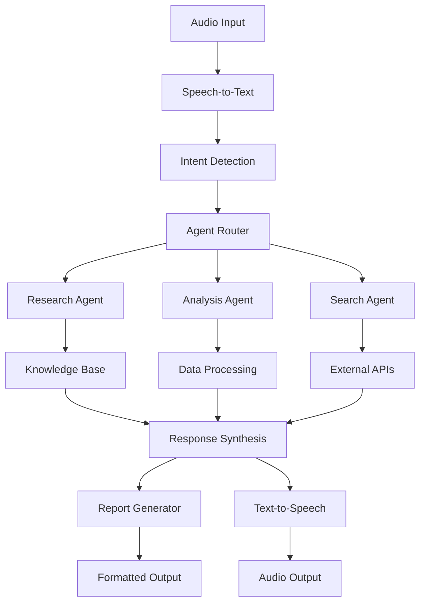

# Audio Chatbot Service Components Analysis Report

## Executive Summary

This report provides a comprehensive analysis of the AI Tutorial Codes codebase to identify components that could support the development of an **audio chatbot service with agent reasoning, database searching, and robust report generation capabilities**.

**Key Finding**: While the codebase does not contain specific audio chatbot implementations, it provides extensive foundational components that can be integrated to build such a system.

## 📋 Table of Contents

- [Codebase Overview](#codebase-overview)
- [Chatbot Framework Components](#chatbot-framework-components)
- [Agent Reasoning Systems](#agent-reasoning-systems)
- [Database & Search Capabilities](#database--search-capabilities)
- [Report & Receipt Generation](#report--receipt-generation)
- [Architecture Recommendations](#architecture-recommendations)
- [Implementation Roadmap](#implementation-roadmap)
- [Technical Requirements](#technical-requirements)

## 🗂️ Codebase Overview

**Total Files Analyzed**: 60+ notebooks and Python files  
**Primary Technologies**: LangChain, LangGraph, Gemini AI, Claude, Ollama, OpenAI  
**Main Categories**: Multi-agent systems, chatbot frameworks, data analysis, report generation  

### Project Structure
```
AI-Tutorial-Codes-Included/
├── Chatbot Frameworks/
│   ├── Lyzr_Chatbot_Framework_Implementation_Marktechpost.ipynb
│   └── streamlit_ai_agent_multitool_interface_Marktechpost.ipynb
├── Agent Systems/
│   ├── LangGraph_Gemini_MultiAgent_Research_Team_Marktechpost.ipynb
│   ├── advanced_ai_agent_hugging_face_marktechpost.py
│   └── Customizable_MultiTool_AI_Agent_with_Claude_Marktechpost.ipynb
├── Search & Retrieval/
│   ├── ollama_langchain_tutorial_marktechpost.py
│   ├── advanced_pubmed_research_assistant_tutorial_Marktechpost.ipynb
│   └── Jina_LangChain_Gemini_AI_Assistant_Marktechpost.ipynb
└── Production Systems/
    └── production_ready_custom_ai_agents_workflows_Marktechpost.ipynb
```

## 🤖 Chatbot Framework Components

### 1. Lyzr Chatbot Framework
**File**: `Lyzr_Chatbot_Framework_Implementation_Marktechpost.ipynb`

**Key Features**:
- PDF-based document chat using OpenAI API
- YouTube transcript processing and analysis
- Interactive chat interface with widget support
- Multi-format report generation (PDF, Markdown, JSON)

**Relevant Functions**:
```python
# Core chat functionality
bot = ChatBot.pdf_chat(input_files=[pdf_path])
response = bot.chat(question)

# Transcript processing
transcript_to_pdf(video_id, output_pdf_path)

# Report generation
create_interactive_chat(agent)
```

**Audio Integration Potential**: 🔴 **Missing**
- No speech-to-text capabilities
- No audio input/output handling
- Text-based interface only

### 2. Streamlit Multi-Agent Interface
**File**: `streamlit_ai_agent_multitool_interface_Marktechpost.ipynb`

**Key Features**:
- Web-based chat interface
- Memory persistence across conversations
- Tool integration (calculator, search, weather)
- Real-time conversation display

**Audio Integration Potential**: 🟡 **Possible Extension**
- Web interface could support audio input widgets
- Streamlit has audio recording components available

## 🧠 Agent Reasoning Systems

### 1. LangGraph Multi-Agent Research Team
**File**: `LangGraph_Gemini_MultiAgent_Research_Team_Marktechpost.ipynb`

**Architecture**:
```python
class AgentState(TypedDict):
    messages: Annotated[list, operator.add]
    next: str
    current_agent: str
    research_topic: str
    findings: dict
    final_report: str
```

**Agent Roles**:
- **Research Agent**: Data gathering and analysis (`create_research_agent`)
- **Analyst Agent**: Deep data analysis and pattern recognition (`create_analyst_agent`)
- **Writer Agent**: Report synthesis and documentation (`create_writer_agent`)
- **Supervisor Agent**: Workflow coordination (`create_supervisor_agent`)

**Reasoning Capabilities**:
- ✅ Multi-step reasoning with state management
- ✅ Agent collaboration and handoffs
- ✅ Context preservation across interactions
- ✅ Decision-making workflow coordination

### 2. Advanced Hugging Face Agent
**File**: `advanced_ai_agent_hugging_face_marktechpost.py`

**Core Capabilities**:
```python
class AdvancedAIAgent:
    def detect_intent(self, user_input): # Intent recognition
    def process_request(self, user_input, context=""): # Request processing
    def generate_response(self, prompt): # Text generation
```

**Reasoning Features**:
- Intent detection and classification
- Multi-model inference (sentiment, Q&A, generation)
- Tool selection and execution
- Context-aware response generation

### 3. Customizable Claude Agent
**File**: `Customizable_MultiTool_AI_Agent_with_Claude_Marktechpost.ipynb`

**LangGraph Implementation**:
```python
def create_agent_graph():
    workflow = StateGraph(AgentState)
    workflow.add_node("agent", agent_node)
    workflow.add_node("tools", tool_node)
    workflow.add_conditional_edges("agent", should_continue)
```

**Advanced Features**:
- ReAct (Reasoning + Acting) pattern
- Tool binding and execution
- Conversation memory management
- Error handling and recovery

## 🔍 Database & Search Capabilities

### 1. RAG (Retrieval-Augmented Generation) System
**File**: `ollama_langchain_tutorial_marktechpost.py`

**Implementation Details**:
```python
class RAGSystem:
    def __init__(self, llm, embedding_model):
        self.embeddings = HuggingFaceEmbeddings(model_name=embedding_model)
        self.vector_store = None  # FAISS implementation
        
    def add_documents(self, file_paths):
        # Document chunking and vectorization
        splits = self.text_splitter.split_documents(documents)
        self.vector_store = FAISS.from_documents(splits, self.embeddings)
        
    def query(self, question):
        # Similarity search and response generation
        result = self.qa_chain({"query": question})
```

**Search Capabilities**:
- ✅ Vector-based similarity search
- ✅ Multi-document retrieval
- ✅ Semantic understanding
- ✅ Source attribution

### 2. PubMed Research Assistant
**File**: `advanced_pubmed_research_assistant_tutorial_Marktechpost.ipynb`

**Specialized Search**:
```python
class AdvancedPubMedResearcher:
    def search_papers(self, query, max_results=5)
    def analyze_research_trends(self, queries)
    def comparative_analysis(self, topic1, topic2)
```

**Features**:
- Biomedical literature search
- Trend analysis and visualization
- Comparative research capabilities
- Statistical analysis of results

### 3. Web Intelligence System
**File**: `production_ready_custom_ai_agents_workflows_Marktechpost.ipynb`

**Advanced Web Search**:
```python
def advanced_web_intelligence(url, analysis_type="comprehensive"):
    # Multi-mode analysis: comprehensive, sentiment, technical, SEO
    return structured_analysis_results
```

## 📊 Report & Receipt Generation

### 1. PDF Report Generation
**File**: `Lyzr_Chatbot_Framework_Implementation_Marktechpost.ipynb`

**Implementation**:
```python
def transcript_to_pdf(video_id, output_pdf_path):
    # YouTube transcript extraction
    # PDF formatting with Unicode support
    # Multi-page document generation
```

**Output Formats**:
- ✅ PDF with formatting
- ✅ Markdown structured reports
- ✅ JSON data export
- ✅ Interactive HTML reports

### 2. Multi-Agent Report Synthesis
**File**: `LangGraph_Gemini_MultiAgent_Research_Team_Marktechpost.ipynb`

**Report Structure**:
```python
final_report = {
    "research_overview": "...",
    "key_findings": ["finding1", "finding2"],
    "analysis_summary": "...",
    "recommendations": "...",
    "executive_summary": "..."
}
```

**Features**:
- Executive summaries
- Detailed findings sections
- Evidence-based recommendations
- Multi-agent collaborative writing

### 3. Performance Analytics
**File**: `production_ready_custom_ai_agents_workflows_Marktechpost.ipynb`

**Metrics Tracking**:
```python
class ToolResult:
    success: bool
    execution_time: float
    metadata: Dict[str, Any]
    
def get_system_status():
    return {
        'agents': agent_performance,
        'workflows': workflow_metrics,
        'success_rates': performance_data
    }
```

## 🏗️ Architecture Recommendations

### Proposed Audio Chatbot Architecture



### Integration Points

1. **Audio Processing Layer** (Missing - Need to Add):
   ```python
   # Required additions
   import speech_recognition as sr
   import pyttsx3 or gTTS
   
   def speech_to_text(audio_input):
       # Convert audio to text
   
   def text_to_speech(text_output):
       # Convert text to audio
   ```

2. **Agent Coordination** (Available):
   - Use LangGraph multi-agent system
   - Implement supervisor pattern
   - Add conversation memory

3. **Knowledge Retrieval** (Available):
   - FAISS vector store
   - RAG implementation
   - Multi-source search

4. **Report Generation** (Available):
   - PDF export functionality
   - Structured data formatting
   - Performance metrics

## 🚀 Implementation Roadmap

### Phase 1: Audio Integration (2-3 weeks)
- [ ] Add speech-to-text processing
- [ ] Implement text-to-speech output
- [ ] Create audio interface wrapper
- [ ] Test audio quality and latency

### Phase 2: Agent Integration (2-3 weeks)
- [ ] Integrate LangGraph multi-agent system
- [ ] Implement conversation memory
- [ ] Add intent detection and routing
- [ ] Create agent coordination layer

### Phase 3: Knowledge Base Setup (1-2 weeks)
- [ ] Configure RAG system
- [ ] Set up vector databases
- [ ] Implement search functionality
- [ ] Add external API integrations

### Phase 4: Report Generation (1-2 weeks)
- [ ] Integrate PDF generation
- [ ] Add structured output formatting
- [ ] Implement receipt/summary templates
- [ ] Create export functionality

### Phase 5: Production Deployment (2-3 weeks)
- [ ] Add error handling and recovery
- [ ] Implement performance monitoring
- [ ] Create deployment configuration
- [ ] Add security and authentication

## ⚙️ Technical Requirements

### Dependencies
```python
# Core AI/ML
langchain>=0.1.0
langgraph>=0.1.0
openai>=1.0.0
transformers>=4.20.0
sentence-transformers>=2.2.0

# Audio Processing (TO ADD)
speech-recognition>=3.10.0
pyttsx3>=2.90
pyaudio>=0.2.11

# Vector Storage
faiss-cpu>=1.7.0
chromadb>=0.4.0

# Report Generation
fpdf2>=2.8.0
markdown>=3.4.0
jinja2>=3.1.0

# Web Interface
streamlit>=1.28.0
gradio>=3.40.0
```

### System Requirements
- **Memory**: 8GB+ RAM (for model loading)
- **Storage**: 10GB+ for models and vector databases
- **Audio**: Microphone and speakers support
- **Network**: Internet access for external APIs

### Performance Considerations
- **Latency**: Target <2s response time for audio
- **Concurrency**: Support 10+ simultaneous conversations
- **Scalability**: Containerized deployment ready
- **Reliability**: 99%+ uptime with error recovery

## 🎯 Conclusion

The analyzed codebase provides **excellent foundational components** for building an audio chatbot service with:

✅ **Strong Agent Reasoning**: Multiple sophisticated agent systems with LangGraph  
✅ **Robust Search Capabilities**: RAG, vector stores, and specialized search tools  
✅ **Comprehensive Report Generation**: PDF, structured formats, and analytics  
🔴 **Missing Audio Processing**: Requires speech-to-text and text-to-speech integration  

**Recommendation**: This codebase is an excellent starting point. The main development effort should focus on adding audio processing capabilities and integrating the existing components into a cohesive audio chatbot service.

**Estimated Development Time**: 8-12 weeks for a production-ready system

---

*Report generated on: 2025-01-26*  
*Analysis covers: 60+ files across multiple AI frameworks*  
*Focus: Audio chatbot service with agent reasoning and report generation*